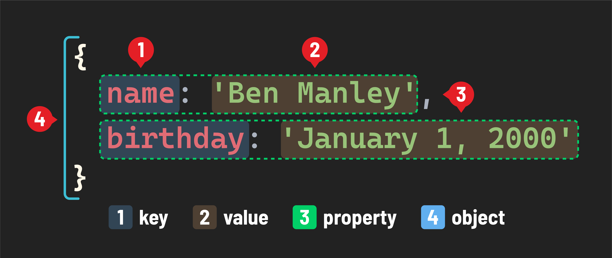

<h1>
  Intro to JavaScript Objects
  Concepts
</h1>

**Learning objective:** By the end of this lesson, students will be able to define objects and their purpose.

## What are objects? 

In JavaScript, an "object" is a fundamental concept. It's like a container that holds related data and functions. Objects are the most common data structure in *object-oriented programming*. 

Very simply, **objects** are a collection of zero or more **properties**.

So what’s a *property*? A *property* consists of a **`key: value`** pair.

- The ***key*** acts as an identifier and must be a *string* or *symbol*. If any other type is used as a *key*, it will be coerced into a *string*.
- The ***value*** is a JavaScript expression that evaluates to a single value or thing. This encompasses simple data types like strings, numbers, or booleans. A *value* can also be an object or a function. When a function is bound to an object, it is called a *method*.

In computer science, collections of key/value pairs are commonly referred to as *dictionaries* - a good visualization of what an object is.

> 📚 Objects are structured data types that hold related data (properties) and behavior (methods) within a single collection. 

> 📚 Properties are attributes associated with the object, which can store data of any data type, such as numbers, strings, or even other objects. Methods are functions associated with an object that define its behavior and can perform actions using the object's properties.

> 📚 Object-oriented programming (abbreviated as OOP) is a programming paradigm that focuses on organizing code around the concept of objects, which represent real-world entities or abstract concepts, encapsulating data and behavior within these objects.

## Why use objects? 

As a developer, you'll often use objects. They are a key part of programming in JavaScript. The following is just a small example of what is modeled using objects:

**Objects in the Browser**

- The browser window and everything you see in it (like buttons, images, text) are represented as objects in JavaScript. This makes it easy to work with and manipulate these elements.

**Styling and Elements**

- The appearance and behavior of webpage elements (like color, size, actions when clicked) are controlled using objects. Each element's style and actions are properties of these objects.

**Handling Data with Objects**

- When you submit data on a website (like filling out a form), this data is handled as an object on the server.
- Similarly, when data is retrieved from a database (like user information), it’s often stored and managed as an object.

In a process called *boxing*, even primitive data types like strings and numbers are turned into an object on demand by the JavaScript runtime when we want to call a method like `toUpperCase`! So, now does it make sense why it’s called **object-oriented programming**?

> 💡 Unlike arrays, the order of properties in objects is not guaranteed. 